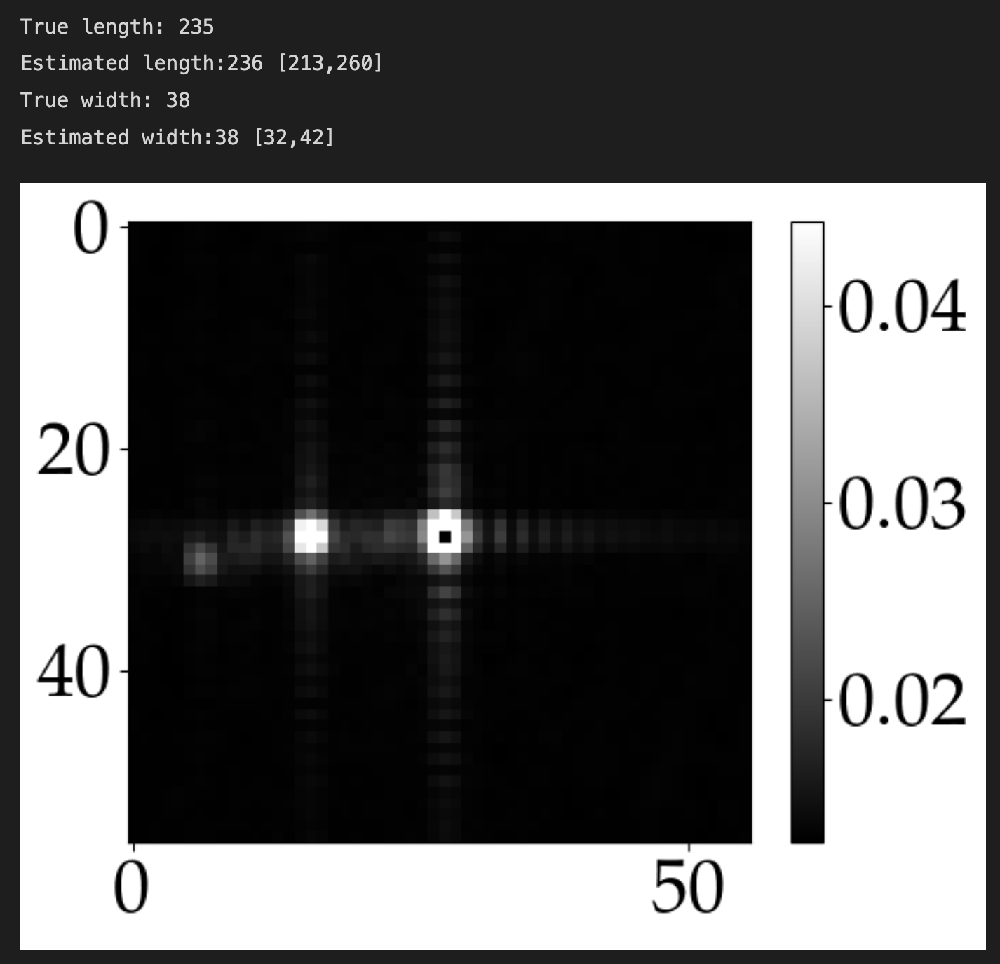
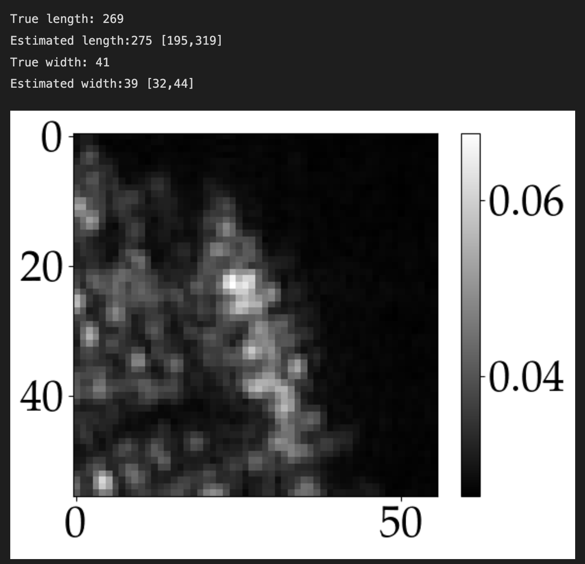

Kristian Aalling Sørensen


# Brief Description
 <a class="anchor" id="Introduction"></a>

In Deep Quantile Regression Synthetic Aperture Radar Ship Size, the objective is to determine ship paramters from Synthetic Aperture Radar (SAR) images, i.e., ship length and ship width. However, the techinque could be fully extended to, e.g., direction, speed, or to classification purposes such as ship type. 

Ship detection and charecerisation is an important part of increasing maritime security and surveillance and when securing maitime sovereignty. For decision makers (local navy, other stakeholder), it is important to know where and how many Dark Ships (Ships that do not transmit self-transmitted information such as AIS data) are present in their waters. Furhtermore, knowing as much information as possible for a found Dark Ships is important when tasking other missions. Missions such as Satellite Tasking, sending out the coast-guard ect. In short, it is important to know:
- is there a dark ships
- how big is the ship (length/width). You act very differently for different ships
- what type of ship is it
- what is it doing.

In the Arctic, you can not use Multi Spectral Images, as you see on Google Earth. In part due to clouds, and partly due to the lack of illumination. You would therefore a SAR instrument. The SAR provides its own illumination and the returned signals (amplitude and phase) is dependant on both the geometrical and underlying physical charectgerstics. However, SAR iamges are subjucated to a great deal of Speckle/Clutter/ other stuff.  The same target can consequently look very different only different images.

In this application, we therefore try to estiamte the 99 % Confidence Interval for an estiamte ship length. This would provide valuable information on the length of the ship. 
For instance, if we have a length estiamtion of 200 m with a Confidence Interval of [190-210] we are quite certain it is a good estiamte.
Conversly, if we have a length estiamte of 200 m with a Confidense Interval of [30-500], we are not very certain. 

Specifically, deterministic models might over estiamte the length to be, e.g., 800 m long which is impossible. If we had an automatic way of saying "this is a bad estiamte", we could just neglegt it somewhat. 


In The Figure below, we see t2o estimates from our model. One of which is clear and the other is not. We see  how the 95CI varies greatly.


<p align="center">
  
  
</p>


# Usage
 <a class="anchor" id="Usage"></a>

 1. Import Model
 --------------------
 ```python
from src.models.model import Model
from src.models._util import seed_everything
from src.analyse_model.analyse import Analyse_model

 ```

 2. Load Model
 -----------------
 ```python 
with Model() as M:
    M.data_load(dataset["images"],dataset["metadata"],dataset["targets"])
    M.model_load(which_model='quantile')
 ```


  3. Analyse model results
 -----------------

  ```python 
with Analyse_model(M.model.model) as anal:
    anal.get_data(
        [
            dataset["testing_images"],
            dataset["testing_metadata"],
            dataset["testing_targets"],
        ]
    )
    anal.get_scaling(scaling_vars)
    anal.inverse_values()
    anal.all_estimates_inverse()
 ```


# Acknowledgments
 <a class="anchor" id="Acknowledgments"></a>
Donno yet. 


