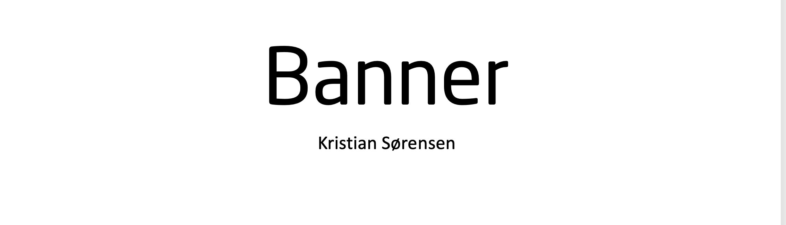

<p align="center">
  
</p>

[](https://zenodo.org/badge/latestdoi/259046250) 
[](https://coveralls.io/github/aalling93/Deep-Quantile-Regression-Synthetic-Aperture-Radar-Ship-Size?branch=master) 
[](https://app.travis-ci.com/aalling/Deep-Quantile-Regression-Synthetic-Aperture-Radar-Ship-Size) 
 
[](https://snyk.io/test/github/aalling93/Deep-Quantile-Regression-Synthetic-Aperture-Radar-Ship-Size/)


Kristian Aalling Sørensen

kaaso@space.dtu.dk

# Brief Description
 <a class="anchor" id="Introduction"></a>
AIS preprocessing


# Table Of Contents
-  [Introduction](#Introduction)
-  [Requirements](#Requirements)
-  [Install and Run](#Install-and-Run)
-  [Overview of results](#Overview-of-results)
-  [Model](#Model)
-  [Results](#Results)
-  [Code structure](#Code-structure)
-  [Usage](#Usage)
-  [Acknowledgments](#Acknowledgments)

# Requirements
 <a class="anchor" id="Requirements"></a>

- [pandas](https://github.com/pandas) (Data wrangling)
- [tensorflow](https://github.com/tensorflow) (The models)
- [tensorflow_probability](https://www.tensorflow.org/probability) (For probability stuff)
- [sklearn](https://scikit-learn.org/stable/) (Used specifically for Cross Validation of the model)
- [scipy](https://scipy.org) (stats when analysing the model)


# Install and Run
 <a class="anchor" id="Install-and-Run"></a>


 1. 
  install Requirements

 2. 
Clone the Repo
 ```
 git clone https://github.com/aalling93/Deep-Quantile-Regression-Synthetic-Aperture-Radar-Ship-Size.git
 ```

  3. 
 Profit


# Usage
 <a class="anchor" id="Usage"></a>

 1. Import Model
 --------------------
 ```python
from src.models.model import Model
from src.models._util import seed_everything
from src.analyse_model.analyse import Analyse_model

 ```

 2. Load Model
 -----------------
 ```python 
with Model() as M:
    M.data_load(dataset["images"],dataset["metadata"],dataset["targets"])
    M.model_load(which_model='quantile')
 ```


  3. Analyse model results
 -----------------

  ```python 
with Analyse_model(M.model.model) as anal:
    anal.get_data(
        [
            dataset["testing_images"],
            dataset["testing_metadata"],
            dataset["testing_targets"],
        ]
    )
    anal.get_scaling(scaling_vars)
    anal.inverse_values()
    anal.all_estimates_inverse()
 ```


# Acknowledgments
 <a class="anchor" id="Acknowledgments"></a>
Donno yet. 

 # Licence
 [](https://creativecommons.org/licenses/by-nc/4.0/)

